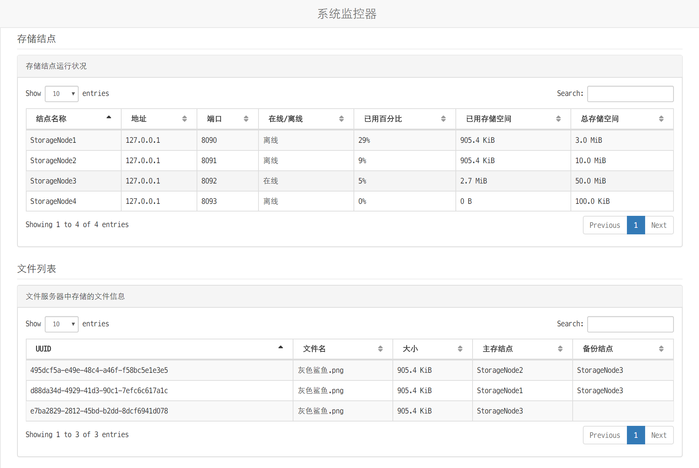
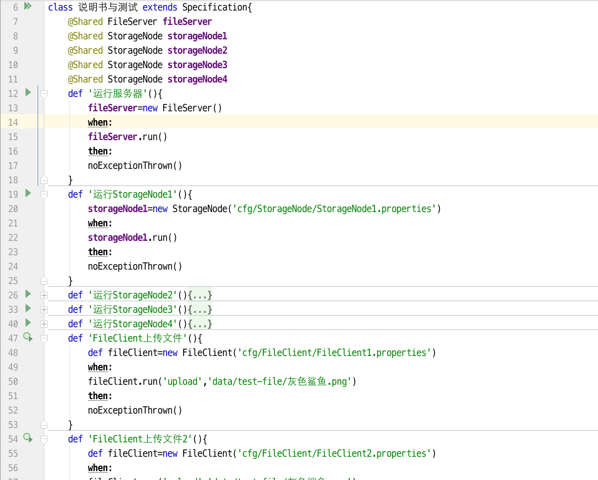
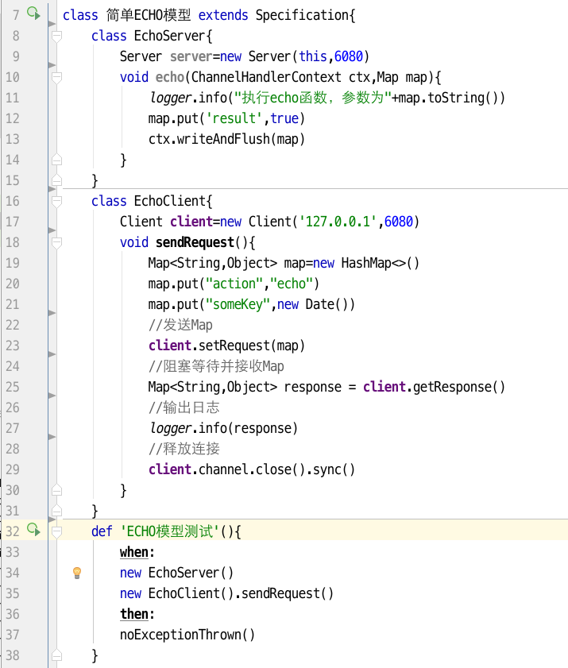
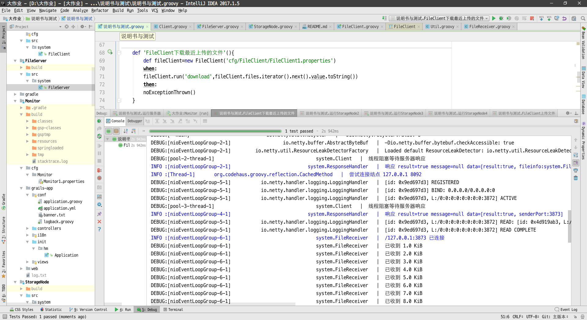
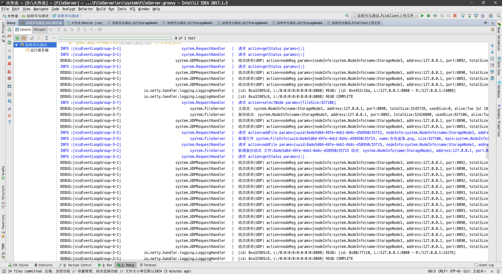
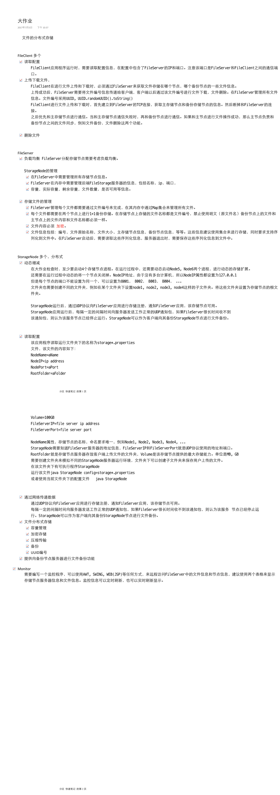
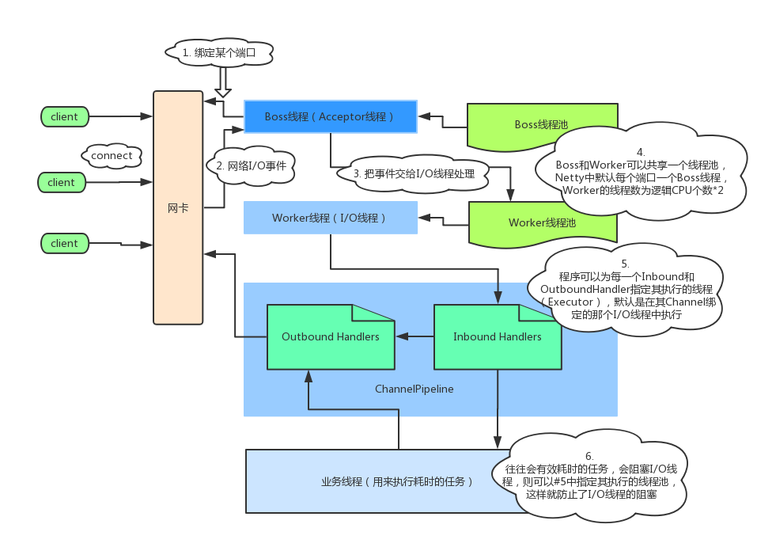

## Monitor

## 说明书

## echo

### 需求

## Netty架构

Netty框架 学习参考

https://www.gitbook.com/book/waylau/essential-netty-in-action/details

https://waylau.gitbooks.io/netty-4-user-guide

https://juejin.im/post/58bbaee6ac502e006b02f607

https://juejin.im/post/58ea47cbda2f60005f070a70